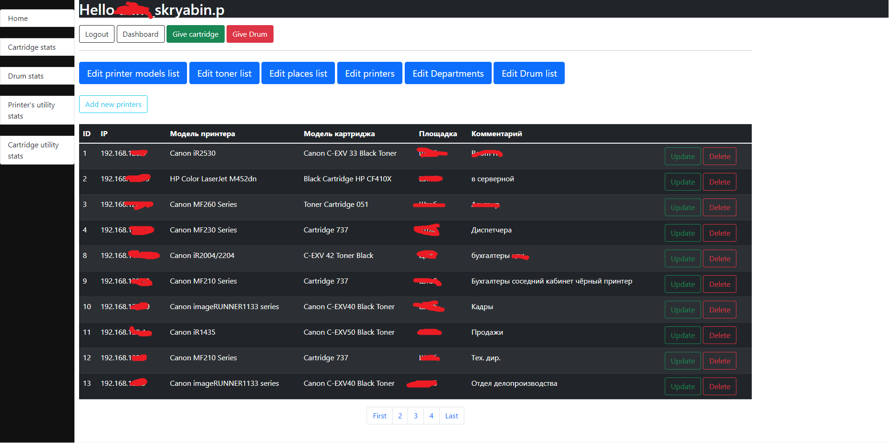

## Web panel for monitoring network printers

It works on Django, also it uses celery and pysnmp library for collecting printers utility stats

#### It was created for my organisation where I am system administrator.

It is my first try with Django, celery and bootstrap. 
Don't judge site design I'm not a frontender at all :D

With celery does requesting printers by snmp every hour from 8am to 22pm and 
records this data about page printing count, toner left in DataBase

### There's few main parts :
1. Admin dashboard. Where we can add printer models, toner models etc. And we use this to add printers 
 
2. Add printer form
 
2. In this page we can see live status and metrics of printers we added in admin dashboard divided by "place" category
 
3. In this page we can see history of withdrawn toners(the same for drums)
 
4. Form for withdrawing toners (the same for drums)
 
5. There's page with all stats collecting with snmp , like count of used toners, pages utility,etc  for every printer
 
6. There's detailed info about page utility for every toner, how long was in work
 